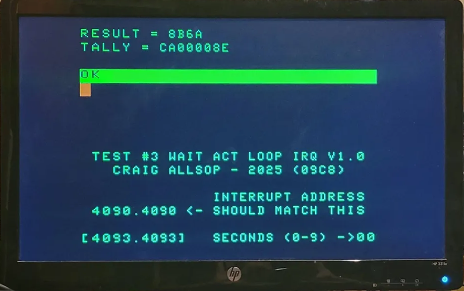

# CoCo Test Disk

Just my collection of test programs that are used to verify coco emulation.

Programs:

**I1.BIN** - Interrupt Test #1 (8C4D) - Tests SYNC / IRQ handler. Runs for 10 seconds and checks for proper operation of interrupt handler, interrupted address and number of interrupts. Produces checksum result of A66C.

**I2.BIN** - Interrupt Test #2 (AE33) - Tests interrupt wait loop, interrupts disabled while waiting & IRQ handler. (Similar to Max-10) Similar to above, should produce checksum result of 5886.

**I3.BIN** - Interrupt Test #3 (09C8) - Tests interrupt wait loop while interrupts active (enabled) & IRQ handler. (Similar to the game Contras) The results for this test vary because
interrupts being enabled can happen anywhere but in this test it should only
occur at address 4090 and 4093. This test will tally up how many for each,
typical results are TALLY = CA00008E as tested on a real CoCo3.

<div align="center">



CoCo 3 - Interrupt Test #3[^fa]

</div>

[^fa]: Image provided by Ed Jaquay

ToDo: Test how often the wait loop while interrupts active in test #3 continue looping after interrupt has occurred, as this seems to affect the title screen of the game Contras.


## Results

| Machine | Version | #1 | #2 | #3 |
| -------- | ------- | -- | -- | -- |
| CoCo 3   | -   |  <green>Pass :heavy_check_mark:</green> | Pass :heavy_check_mark: | Pass :heavy_check_mark: Tally = CA00008E<sup>1</sup> |
| MAME coco3 | 0277b   |  <green>Pass :heavy_check_mark:</green> | Pass :heavy_check_mark: | Pass :heavy_check_mark: |
| xroar coco3p | 1.5     |  Pass :heavy_check_mark: | Pass :heavy_check_mark: | Pass :heavy_check_mark: Tally = B10000A7 |
| xroar coco3p | 1.8.1   |  Pass :heavy_check_mark: | Pass :heavy_check_mark: | Pass :heavy_check_mark: Tally = BD00009B |
| VCC      | <2.1.9.1 |   No :x: |  No :x: |  No :x: Tally = 510000DB| 
| VCC      | 2.1.9.2 | Pass :heavy_check_mark: | Pass :heavy_check_mark: | Pass :heavy_check_mark: Tally = 980000C0 | 
| trs80gp<sup>2</sup>  | 2.5.4 | Pass :heavy_check_mark: | Pass :heavy_check_mark: | Pass :heavy_check_mark: Tally = B40000A4 | 
| Coco3FPGA  | :grey_question: | :grey_question: | :grey_question: | :grey_question: | 
| RealCoco3  | :grey_question: | :grey_question: | :grey_question: | :grey_question: | 

1. Interestingly on test #3 a real CoCo 3 interrupts from address 4090 more often than 4093.
2. Something is not quite right though because Dungeons of Daggorath zooms though the title screen as if its not vsync'ing and during game play sometimes skips forward very quickly.

## Building

To build the dsk image require some tools...

### Requirements

- [Jam 2.6.1](https://github.com/callsop/perforce-jam)
- [Toolshed 2.4.1](https://github.com/nitros9project/toolshed)
- [Lwtools 4.24](http://www.lwtools.ca)

#### Linux

Assumes toolshed and xroar or vcc are installed to /usr/local/bin - if not edit the paths in Jamrules. Install Lwtools with my script ```setup/lwtools.sh``` that downloads and installs it.

To install jam use apt:

```
sudo apt install jam
```

#### Windows

Jam 2.6.1 is here: https://github.com/callsop/perforce-jam/releases/tag/v2.6.1 just extract it somewhere and add to the PATH. Download the latest Toolshed release from link above, mine is installed at c:\Programs\toolshed-2.4. Windows version of Lwtools needs to be built from source as its not available anywhere I could find at this time.

### Building .dsk image

```
$ jam dsk
...found 10 target(s)...
...updating 4 target(s)...
Assemble I1.BIN
Assemble I2.BIN
Assemble I3.BIN
MakeDisk1 craigtst.dsk
Decb craigtst.dsk
Decb craigtst.dsk
Decb craigtst.dsk
...updated 4 target(s)...
```

### Clean

```
$ jam clean
...found 2 target(s)...
...updating 1 target(s)...
Clean clean
...updated 1 target(s)...
```

## Running

### Requirements

Either of these can be used:

- xroar 1.8.1
- vcc 2.1.9.2

### Launching with xroar

Use the label x- and program name.

```
jam x-i1
```

### Launching with vcc

Use the label v- and program name.

```
jam v-i1
```


